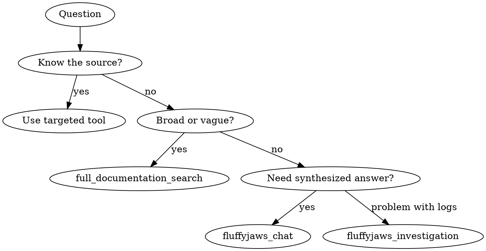

# FluffyJaws — MCP Tool Routing Guide

FluffyJaws MCP provides 28 specialized tools for querying Adobe internal knowledge across documentation, Slack, Jira, infrastructure, and more. Use this guide to pick the right tool for the job.

## When to Use

- AEM Content Fragments, fragment models, publishing pipelines
- Adobe internal APIs (odin, odinpreview, AEM author/publish)
- Infrastructure and deployment (I/O Runtime, Helix, Franklin/AEM Edge)
- Internal tooling and services
- Debugging Adobe-specific errors or behaviors
- Jira ticket lookups, Dynamics incidents
- Cloud Manager pipelines, tenants, environments
- Any Adobe/AEM question — even if you think you know the answer

## When NOT to Use

- Purely code-syntax questions (use context7/docs instead)
- Non-Adobe topics with no internal context needed
- Questions purely about this codebase's implementation (e.g., "where is function X defined?")

## Tool Selection



## Quick Reference

All tools are prefixed with `mcp__fluffyjaws__`. For example, call `mcp__fluffyjaws__fluffyjaws_chat`.

### Knowledge & Documentation

| Intent | Tool | Param |
|--------|------|-------|
| Broad search across all sources | `full_documentation_search` | `search` |
| AEM Cloud Service docs | `experience_league_documentation_search` | `search` |
| Internal wiki/CSME procedures | `wiki_documentation_search` | `search` |
| Slack conversation history | `slack_search` | `search` |
| Sling framework | `sling_documentation_search` | `search` |
| Oak framework | `oak_documentation_search` | `search` |
| Marketo docs | `marketo_documentation_search` | `search` |
| HelpX portal | `helpx_documentation_search` | `search` |
| Troubleshooting runbooks | `skyline_runbooks_search` | `search` |
| Sales/product resources | `field_readiness_sharepoint_search` | `searchQueries` (array) |
| Investigate a problem | `fluffyjaws_investigation` | `problemStatement` |
| General question | `fluffyjaws_chat` | `query` |

### Tickets & Incidents

| Intent | Tool | Param |
|--------|------|-------|
| Search Jira by topic | `jira_search` | `search` |
| Get specific Jira ticket | `jira_ticket_search` | `ticketId` (e.g. SKYOPS-54712) |
| Get Dynamics incident | `dynamics_ticket_search` | `incidentId` (e.g. E-001481934) |
| Customer's recent tickets | `tenant_dynamics_ticket_list` | `imsOrgId` |

### Infrastructure (Cloud Manager)

| Intent | Tool | Params |
|--------|------|--------|
| Find tenant/program | `tenant_or_program_search` | `search` |
| List tenant's programs | `tenant_program_list` | `tenantId` |
| Get program info | `program_search` | `programId` |
| List environments | `program_environment_list` | `programId` |
| Get environment details | `environment_search` | `programId` + `environmentId` |
| List pipelines | `program_pipeline_listing` | `programId` |
| List executions | `program_pipeline_execution_listing` | `programId` |
| Find pipeline failures | `program_pipeline_execution_failure_listing` | `programId` + `pipelineId` + `pipelineExecutionId` |
| Deep-dive failure | `program_pipeline_execution_failure_investigation` | `programId` + `pipelineId` + `pipelineExecutionId` |

### Utility

| Intent | Tool | Param |
|--------|------|-------|
| Web search | `google_web_search` | `query` |
| Generate image | `generate_image` | `prompt` + optional `size`, `quality`, `n` |
| Switch to AEM Data Agent | `aem_agent_switch` | `question` + `reason` |

## CLI Fallback

If MCP tools are unavailable, fall back to CLI via Bash:
```bash
fj chat "your question here"
```

## Output Handling

FluffyJaws responses can be verbose. After receiving a response:
1. Extract only the parts relevant to the current task
2. Summarize concisely for the user
3. Do not dump the full response verbatim
